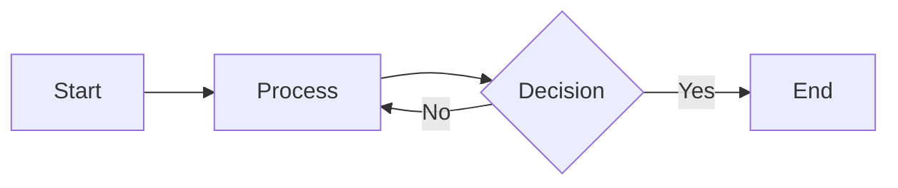

# Example Document

This is a sample markdown document to demonstrate the PDF converter.

## Features

### Headings

All headings automatically become **clickable bookmarks** in the PDF!

### Lists

Unordered list:

- Item 1
- Item 2
  - Sub-item 2.1
  - Sub-item 2.2
- Item 3

Ordered list:

1. First step
2. Second step
3. Third step

### Code Blocks

Inline code: `const x = 42`

Block code:

```javascript
function hello(name) {
  console.log(`Hello, ${name}!`);
}
```

### Tables

| Feature   | Supported |
| --------- | --------- |
| Bookmarks | ✅ Yes    |
| Mermaid   | ✅ Yes    |
| Tables    | ✅ Yes    |
| Chinese   | ✅ 是     |

### Mermaid Diagrams



### Blockquotes

> This is a quote.
> It can span multiple lines.

### Links

[Visit GitHub](https://github.com)

### Chinese Text

中文支持完美！这是一段中文文字。

## Summary

This example demonstrates all the key features of the markdown to PDF converter.
